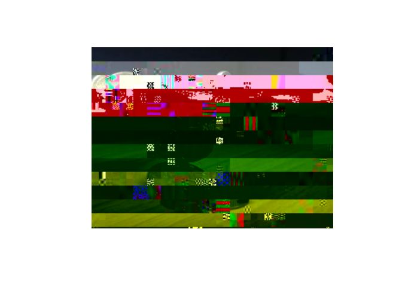

<!-- README.md is generated from README.Rmd. Please edit that file -->

# pacotegha

<!-- badges: start -->

[](https://github.com/jstatlab/pacotegha/actions/workflows/check-release.yaml)
<!-- badges: end -->

``` r
library(pacotegha)
gerar_grafico()
```


